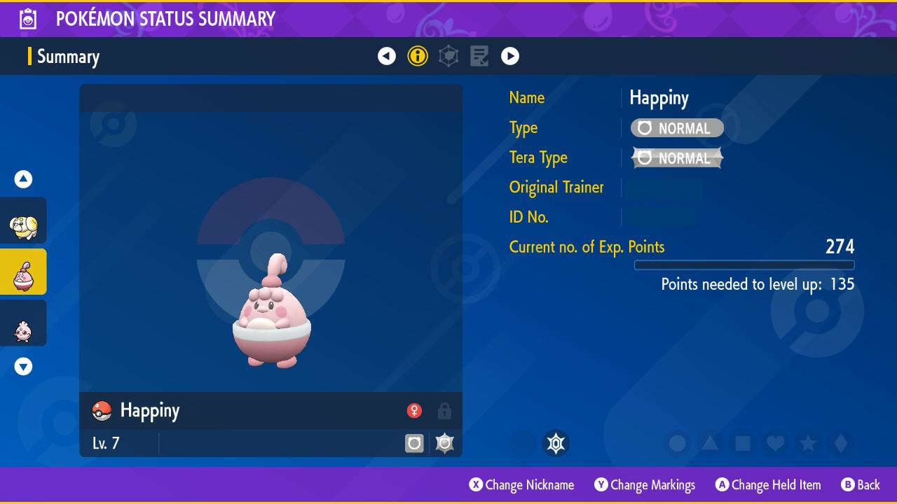

# Project Pokedex

Projeto desenvolvido com [Angular CLI](https://github.com/angular/angular-cli) versão 16.2.0.

Consumindo API do [PokeAPI](https://pokeapi.co/), mostrando todos os pokemons, em suas respectivas gerações.

## Referência de interface
Printscreen do jogo Pokemon Violet, da Nintendo.

### Executando no local

Execute o comando `ng serve -o` para execução local. Navegue pelo `http://localhost:4200/`. O aplicativo será recarregado automaticamente se você alterar algum dos arquivos de origem.

